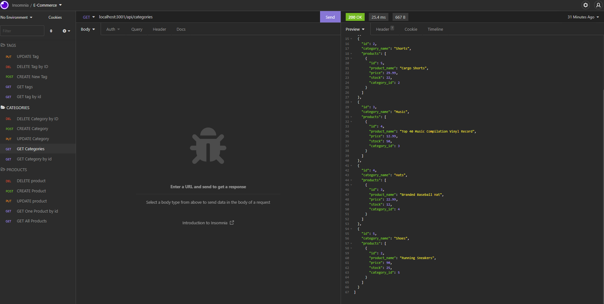
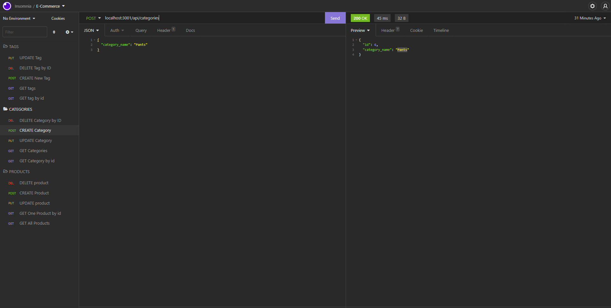
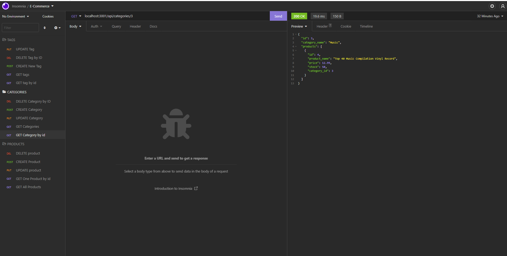

# E-commerce Back End Starter Code

## Table of Contents

-[Description](#Description)

-[Programming Languages, Technologies/Frameworks](#Programming-Languages,-Technologies/Frameworks)

-[Installation](#Installation)

-[Contribution](#Contribution)

-[URL](#URL)

## Description

Refactored code to build the back end for an e-commerce site by taking a working Express.js API and configure it to use Sequelize to interact with a MySQL database.

## Programming Languages, Technologies/Frameworks

- Javascript
- mySQL
- Express.js
- Sequelize
- Insomnia

## Installation

1. In the command line run: mysql
2. Run: source db/schema.sql
3. Run: quit
4. Npm run seed
5. Npm start
6. Open insomnia

## Contribution

true

### Screenshots

### Walkthrough Video

[Tutorial]https://drive.google.com/file/d/19b534wqssPQbpD_Ght9THLBGT_wMk3UM/view 

### URL of the GitHub repository:

<https://github.com/adorsey5/e-commerce>
